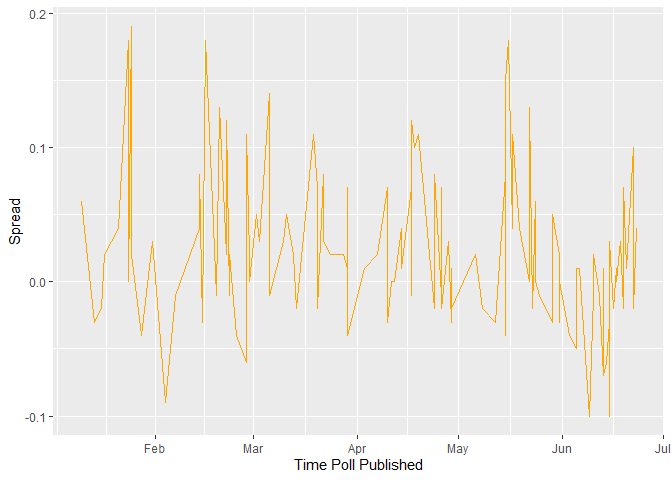

Predicting Brexit Referendum Based On Polls: One Day Before Vote
================
Abhinav Dholepat
27/07/2020

## Loading Packages And Data

``` r
library(dslabs)
```

    ## Warning: package 'dslabs' was built under R version 3.6.3

``` r
library(ggplot2) 
```

    ## Warning: package 'ggplot2' was built under R version 3.6.3

``` r
library(dplyr)
```

    ## Warning: package 'dplyr' was built under R version 3.6.3

    ## 
    ## Attaching package: 'dplyr'

    ## The following objects are masked from 'package:stats':
    ## 
    ##     filter, lag

    ## The following objects are masked from 'package:base':
    ## 
    ##     intersect, setdiff, setequal, union

``` r
library(tidyverse)
```

    ## Warning: package 'tidyverse' was built under R version 3.6.3

    ## -- Attaching packages ------------------------------------------------------------------- tidyverse 1.3.0 --

    ## v tibble  3.0.3     v purrr   0.3.4
    ## v tidyr   1.1.0     v stringr 1.4.0
    ## v readr   1.3.1     v forcats 0.5.0

    ## Warning: package 'tibble' was built under R version 3.6.3

    ## Warning: package 'tidyr' was built under R version 3.6.3

    ## Warning: package 'readr' was built under R version 3.6.3

    ## Warning: package 'purrr' was built under R version 3.6.3

    ## Warning: package 'stringr' was built under R version 3.6.3

    ## Warning: package 'forcats' was built under R version 3.6.3

    ## -- Conflicts ---------------------------------------------------------------------- tidyverse_conflicts() --
    ## x dplyr::filter() masks stats::filter()
    ## x dplyr::lag()    masks stats::lag()

``` r
data("brexit_polls")
```

## Basic Graphs To Understand Data

``` r
brexit_polls %>% 
  ggplot(aes(x = enddate)) + 
  geom_line(aes(y = remain), color = "Blue") + 
  geom_line(aes(y = leave), color = "Red") +
  xlab("Time Poll Published") + 
  ylab("Blue is Remain, Red is Leave")
```

<!-- -->

``` r
brexit_polls %>% 
  ggplot(aes(enddate, spread)) + 
  geom_line(color = "Orange") + 
  xlab("Time Poll Published") + 
  ylab("Spread") 
```

<!-- -->

``` r
brexit_polls <- brexit_polls %>% 
  mutate(p = ((spread + 1) / 2)) %>% 
  mutate(se = sqrt((p * (1 - p)) / samplesize)) %>% 
  mutate(lower = (spread - (2 * se)), upper = (spread + (2 * se))) 

brexit_polls %>% 
  ggplot(aes(x = enddate)) + 
  geom_line(aes(y = lower), color = "Red") + 
  geom_line(aes(y = upper), color = "Blue") +
  xlab("Time Poll Published") + 
  ylab("95% Confidence Interval of Spread") 
```

<!-- -->

## Wrangling And Adjusting Data

The Code below does the following: 1) It finds the true spread; meaning,
it assumes that “undecided” voters will, in the end, have to choose
“remain”, “leave” or not vote at all, we assume that this occurs
randomly. 2) We use the true spread to construct a new confidence
interval 3) Finds crediable pollster (polling organizations who have
conducted more than 7 polls) 4) Filtering the poll data to one week
before the vote, since people change their mind over time

``` r
brexit_polls %>% 
  group_by(pollster) %>% 
  summarize(n())
```

    ## `summarise()` ungrouping output (override with `.groups` argument)

    ## # A tibble: 16 x 2
    ##    pollster                          `n()`
    ##    <fct>                             <int>
    ##  1 BMG Research                          7
    ##  2 ComRes                               10
    ##  3 Greenberg Quinlan Rosner Research     1
    ##  4 ICM                                  28
    ##  5 Ipsos MORI                            7
    ##  6 Opinium                               9
    ##  7 ORB                                  14
    ##  8 ORB/Telegraph                         1
    ##  9 Panelbase                             1
    ## 10 Populus                               1
    ## 11 Populus/Number Cruncher Politics      4
    ## 12 Survation                             7
    ## 13 Survation/IG Group                    1
    ## 14 TNS                                   9
    ## 15 YouGov                               26
    ## 16 YouGov/The Times                      1

``` r
data <- brexit_polls %>% 
  mutate(true_remain = (remain / (remain + leave)), true_leave = (leave / (remain + leave))) %>% 
  mutate(true_spread = (true_remain - true_leave)) %>% 
  mutate(true_p = ((true_spread + 1) / 2)) %>% 
  mutate(se = (2 * sqrt(((true_p) * (1 - true_p)) / samplesize))) %>% 
  mutate(true_lower = (true_spread - (1.96 * se)), true_upper = (true_spread + (1.96 * se))) 


final_data <- data %>% 
  group_by(pollster) %>% 
  filter(n() >= 7) %>%
  filter(enddate == max(enddate)) %>%
  ungroup() %>% 
  filter(enddate <= "2016-06-22")
```

``` r
final_data %>% 
  ggplot(aes(enddate)) + 
  geom_line(aes(y = true_lower), color = "Blue") + 
  geom_line(aes(y = true_upper), color = "Red") + 
  xlab("Time Poll Pubished") + 
  ylab("95% Confidence Interval Of Spread") 
```

<!-- -->

## Final Calculations

Code below does the following: 1) We are left with 11 polls. Since these
polls are taken is different locations around the UK, we treat all 11
polls as 1 single poll. We now get a very large sample and new spread of
opnion. 2) We use this to calculate the 95% confidence interval of vote
outcome 3) We calculate probability of UK voting to leave the EU 4) We
calculate the t score by placing each of the 11 polls in a basket of
polls and finding the probability of leaving the EU

``` r
mean_spread <- final_data %>% 
  summarize(d = (sum(true_spread * samplesize)) / (sum(samplesize))) %>%  
  pull(d)

print("Mean Spread")
```

    ## [1] "Mean Spread"

``` r
mean_spread
```

    ## [1] -0.009812029

``` r
p_hat <- (mean_spread + 1) / 2 

N <- sum(final_data$samplesize) 

final_se <- 2 * sqrt((p_hat * (1 - p_hat)) / N)

print("Lower Bound Confidence Interval Of Vote Outcome")
```

    ## [1] "Lower Bound Confidence Interval Of Vote Outcome"

``` r
mean_spread - (2 * final_se)
```

    ## [1] -0.02546496

``` r
print("Upper Bound Confidence Interval Of Vote Outcome")
```

    ## [1] "Upper Bound Confidence Interval Of Vote Outcome"

``` r
mean_spread + (2 * final_se)
```

    ## [1] 0.005840906

``` r
### Probability of Voting to leave the EU 
print("Probability Of Leaving EU")
```

    ## [1] "Probability Of Leaving EU"

``` r
pnorm(0, mean_spread, final_se)
```

    ## [1] 0.8950242

``` r
### t test, treating each poll as a part of a basket of polls ### 

avg <- mean(final_data$true_spread)
SSDD <- sd(final_data$true_spread)  
t <- (0 - avg) / (SSDD / sqrt(10)) 
print("Probability Of Leaving EU, t-score")
```

    ## [1] "Probability Of Leaving EU, t-score"

``` r
pt(t, 9) 
```

    ## [1] 0.5459827
